# PLS-CNN-for-Chemometrics

This project is currently under construction.

The documentation, source code, and additional resources will be available soon. 
Thank you for your patience.


## Overview

**PYCAL** is the desktop prototype developed for researchers and analysts working on multivariate calibration with first-order spectral data.

It integrates, in a single and structured environment, the main stages required to **train, evaluate, and compare calibration models** based on both **classical chemometric methods** and **CNN-1D architectures**. The goal is to provide a practical, research-oriented tool for experimentation, benchmarking, and model interpretation in chemometrics.

## Features

- Unified workflow for multivariate calibration
- Classical methods: **PLSR** and **PCR**
- Neural network methods: **MLP** and **CNN-1D**
- Bayesian hyperparameter optimization with **Optuna**
- Support for `.txt`, `.csv`, and `.mat` datasets
- Spectral preprocessing and manual region selection
- Calibration, monitoring, validation, and prediction workflow
- Interactive plots for diagnostics and model analysis
- Python-based execution and standalone `.exe` distribution

## Technology Stack

- **Main language:** Python
- **Graphical interface:** Tkinter
- **Classical models:** scikit-learn
- **Neural networks:** PyTorch
- **Hyperparameter optimization:** Optuna
- **Data handling:** NumPy / pandas
- **Plots and visualization:** matplotlib

## Repository Structure

```text
.
├── globals.py
├── main.py
└── library/
    ├── class_cnn.py
    ├── class_da.py
    ├── class_load.py
    ├── class_load_csv.py
    ├── class_load_mat.py
    ├── class_load_txt.py
    ├── class_mlp.py
    ├── class_model.py
    ├── class_optuna.py
    ├── class_pcr.py
    ├── class_plots.py
    ├── class_plsr.py
    ├── class_tk_cnn.py
    ├── class_tk_mlp.py
    ├── class_tk_pcr.py
    ├── class_tk_plsr.py
    ├── class_validate.py
    ├── constants.py
    ├── customs_criterion.py
    ├── extras.py
    ├── metrics.py
    ├── preprocessing.py
    ├── resource_path.py
    └── tk_functions_plots.py
```

## Installation

```bash
git clone https://github.com/dcolliard/PLS-CNN-for-Chemometrics_public.git
cd PLS-CNN-for-Chemometrics_public
python -m venv .venv
```

Activate the environment:

**Linux / macOS**
```bash
source .venv/bin/activate
```

**Windows**
```bash
.venv\Scripts\activate
```

Install dependencies:

```bash
pip install -r requirements.txt
```

## Running the Application

Run the GUI from Python:

```bash
python main.py
```

A standalone **`.exe` version** can also be distributed for end users.

> Add executable download link here:  
> **[PYCAL standalone release](#)**

## Data

This repository **does not include datasets**.

Users must provide their own spectral datasets. The expected workflow uses four input files:

- `Xcal`: calibration predictors
- `ycal`: calibration reference values
- `Xval`: validation predictors
- `yval`: validation reference values

Supported file formats:

- `.txt`
- `.csv`
- `.mat`

## Typical Workflow

1. Load `Xcal`, `ycal`, `Xval`, and `yval`
2. Inspect the spectral signals and response distributions
3. Apply preprocessing if needed
4. Exclude samples or restrict spectral regions
5. Select a modeling method
6. Configure the hyperparameters
7. Train and evaluate the model
8. Validate on external data
9. Save the fitted model for future prediction

## Methods Included

### PLSR / PCR
- Cross-validation for component selection
- Leave-One-Out and K-fold support
- PRESS-based diagnostics
- Calibration and external validation views

### MLP
- Single-hidden-layer neural model for nonlinear calibration
- Grid search over low-dimensional hyperparameter spaces
- Monitoring-set-based model selection

### CNN-1D
- Bayesian hyperparameter optimization with Optuna
- Search-space definition through the GUI
- Trial tracking, importance plots, and best-model summary
- Calibration, monitoring, external validation, and intermediate activation analysis

## Example Usage

### Example 1 - Load and inspect data
1. Open the application.
2. Choose the loader according to your data format (`.txt`, `.csv`, or `.mat`).
3. Load `Xcal`, `ycal`, `Xval`, and `yval`.
4. Inspect the preview plots and dataset dimensions.

### Example 2 - Run PLSR or PCR
1. Load the dataset.
2. Apply preprocessing if needed.
3. Select **PLSR** or **PCR**.
4. Run cross-validation to estimate the optimal number of components.
5. Review calibration diagnostics and external validation results.
6. Save the fitted model.

### Example 3 - Run an MLP workflow
1. Load and preprocess the dataset.
2. Select **MLP**.
3. Define the search range for input features and hidden units.
4. Choose the optimizer, activation function, and training parameters.
5. Launch the grid search.
6. Compare candidate models and generate the final one.

### Example 4 - Run a CNN workflow
1. Load and inspect the dataset.
2. Select **CNN**.
3. Define the hyperparameter search space.
4. Configure optimizer, augmentation strategy, iteration count, and maximum optimization time.
5. Start the Optuna optimization.
6. Review the best architecture, training behavior, and external validation results.
7. Save the best model.

## Screenshots

### Main window
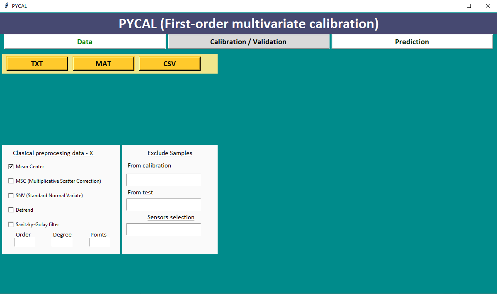

Main application screen before data loading, showing the main workflow modules and preprocessing tools.

### Data loading window
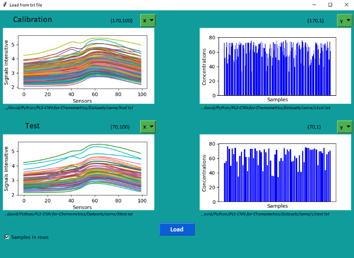

Dialog used to load the calibration and validation matrices and check input consistency.

### Loaded data and initial setup
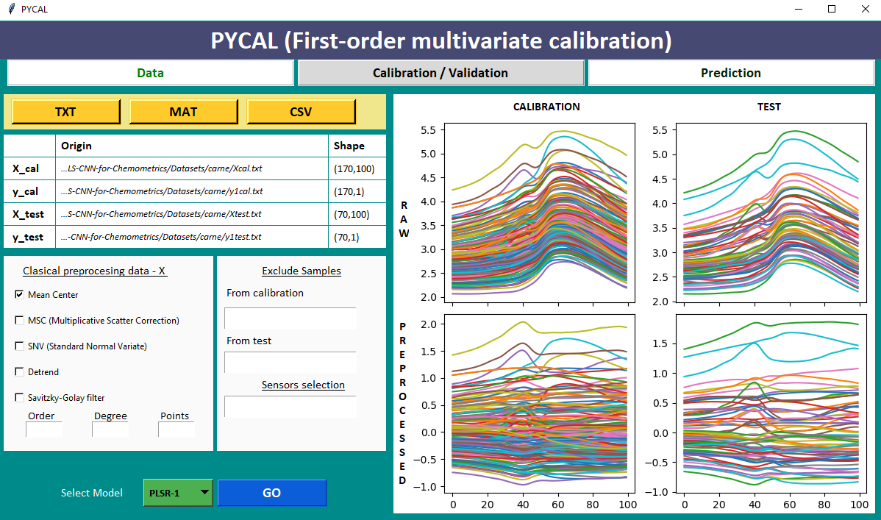

View of imported spectra with controls for preprocessing, sample exclusion, and spectral region selection.

### PLSR cross-validation
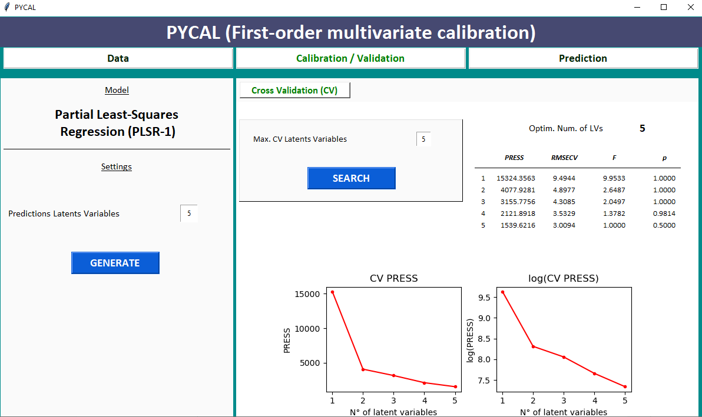

Cross-validation view used to determine the optimal number of latent variables/components.

### PLSR calibration summary
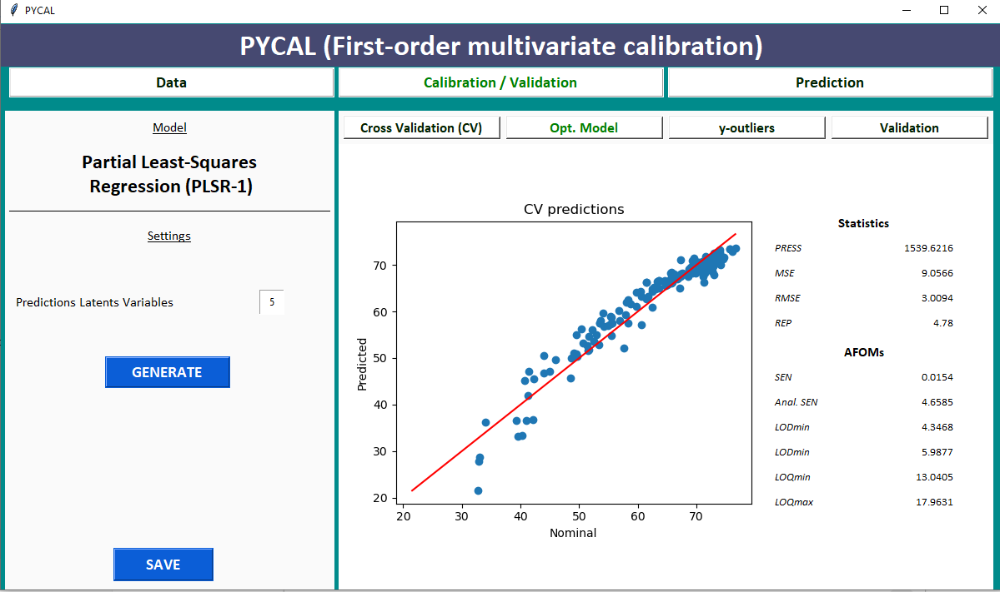

Summary of the fitted linear model, including performance statistics and calibration plots.

### PLSR external validation
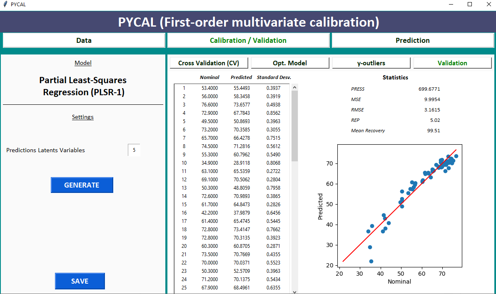

External validation results on the validation set.

### MLP search configuration
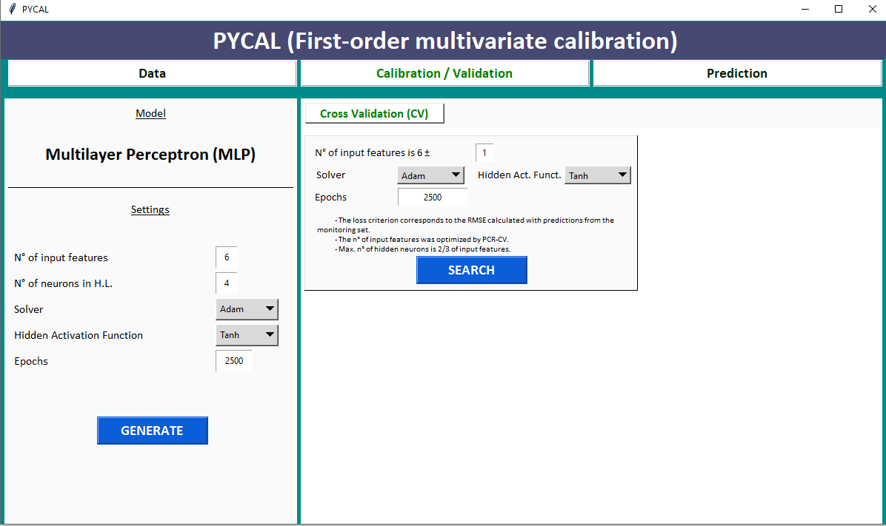

Initial MLP setup screen for defining the search space and training settings.

### MLP search results
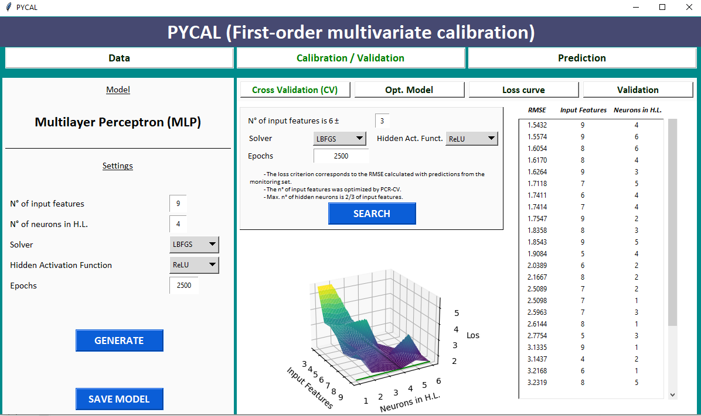

Comparison of the candidate MLP configurations explored during grid search.

### MLP calibration summary
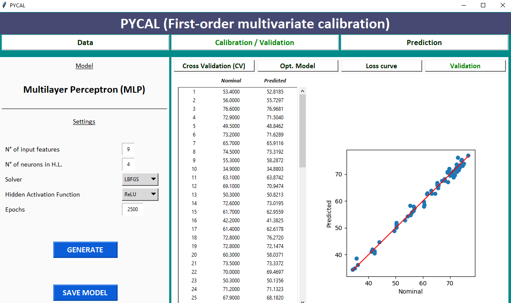

Performance summary for the selected MLP model on calibration data.

### MLP external validation
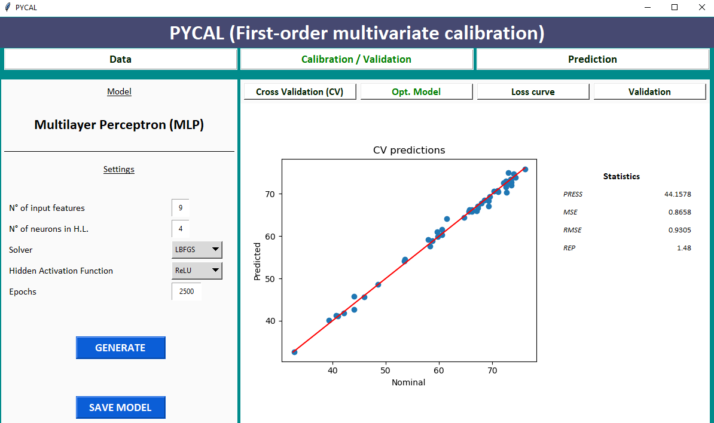

External validation view for the selected MLP model.

### CNN Optuna configuration
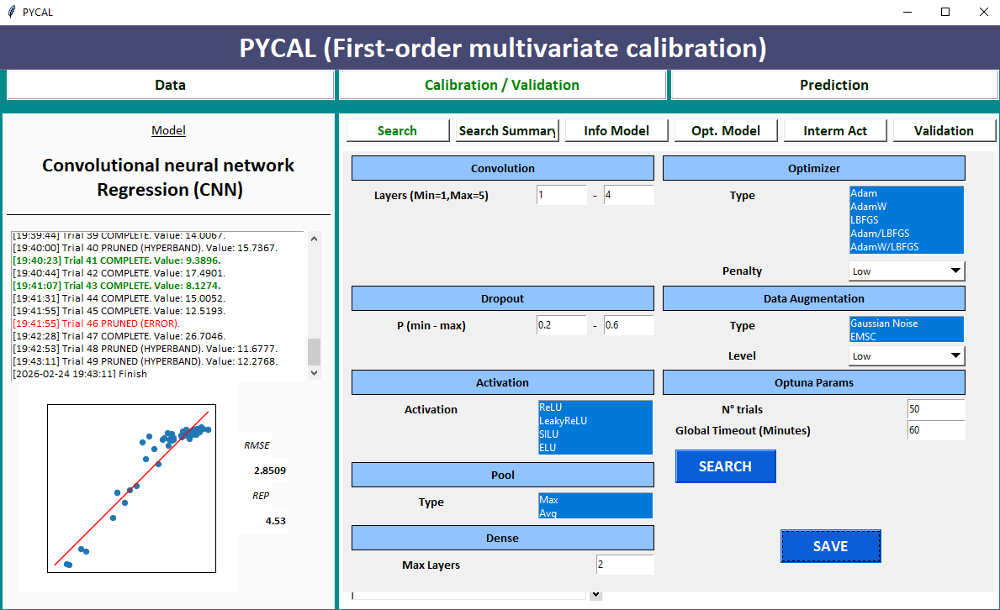

GUI used to define the CNN search space and launch Optuna-based optimization.

### CNN optimization tracking
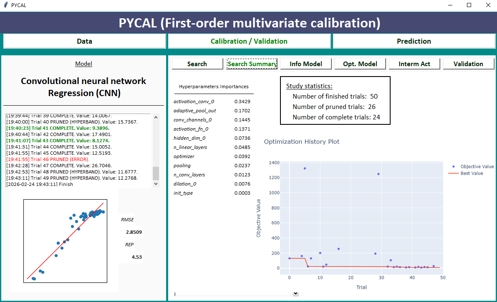

Objective evolution and hyperparameter importance during the CNN search.

### Best CNN model summary
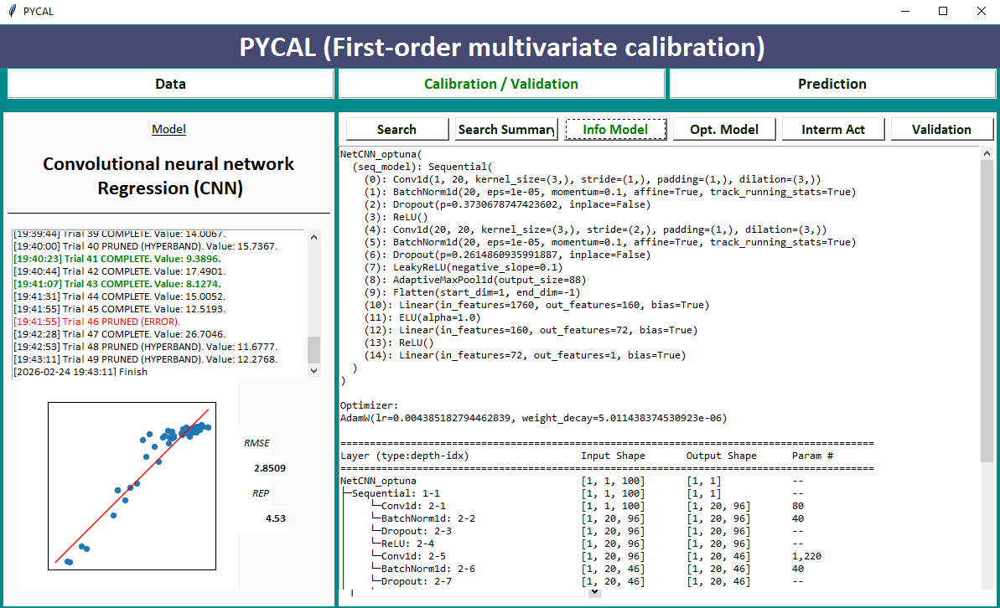

Summary of the best CNN architecture and optimization settings found.

### CNN calibration and monitoring
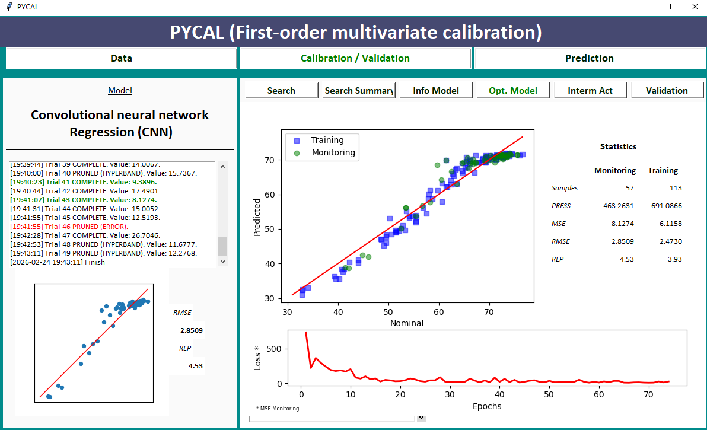

Calibration and monitoring performance used to inspect training behavior and overfitting.

### CNN intermediate activations
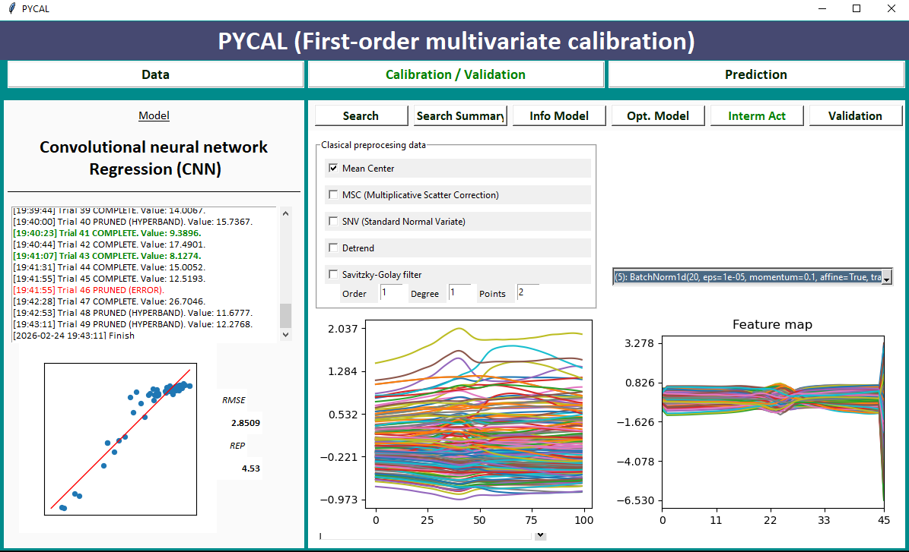

Intermediate CNN activations for model interpretation and exploratory analysis.

### CNN external validation
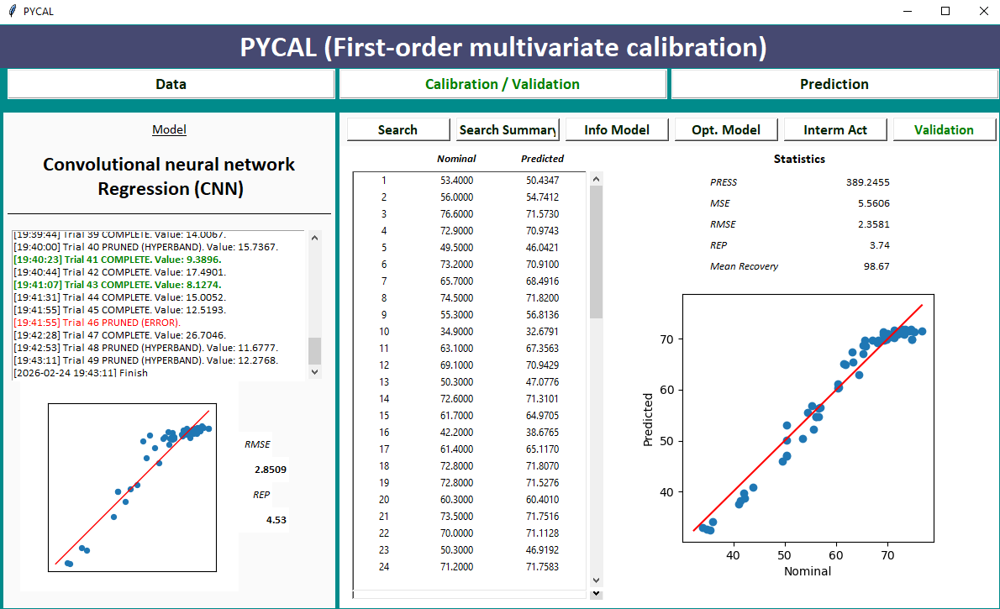

Final external validation of the selected CNN model on unseen data.

## Citation

Citation metadata is provided through the repository `CITATION.cff` file.

## License

This project is licensed under the **Apache License 2.0**.  
See the [LICENSE](LICENSE) file for details.

## Authors

### Carlos David Colliard Schneider
- Email: carloscolliard@gmail.com
- Affiliation: Laboratorio de Análisis, Procesamiento, Almacenamiento y Control de Datos (LAPACDA), Fac. de Ciencia y Tecnología, Univ. Autónoma de Entre Ríos, Entre Ríos, Argentina

### Fabricio Chiapini
- Affiliation: Laboratorio de Desarrollo Analítico y Quimiometría (LADAQ), Fac. de Bioquímica y Cs. Biológicas, Univ. Nacional del Litoral, Santa Fe, Santa Fe, Argentina

